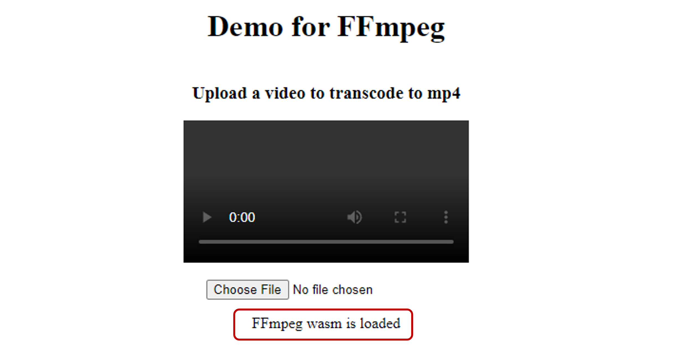
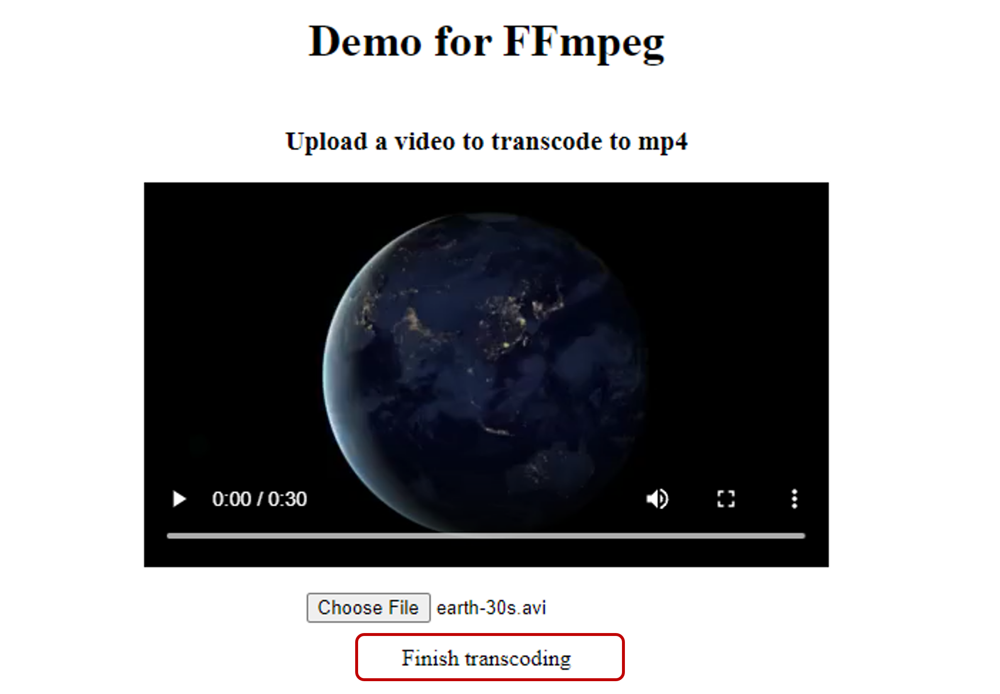

# Tutorial for building and running FFmpeg WASM demo with Webinizer

In order to use FFmpeg to transcode a video from `.avi` to `.mp4` format and play it in the browser,
we need to build `FFmpeg` together with the `x264` library.

We'd build `x264` at first as a dependency, and then build `FFmpeg` to utilize the library.

For the tutorial for building the `x264` library, please refer to the [README](../x264/README.md)
file for details.

## How to build FFmpeg with Webinizer

1. **`Main page`** - Click `Get Started` in Webinizer main page to enter the project list page.

2. **`Get started page`** - Click the `SELECT` button of the FFmpeg project to enter the
   `Basic config` page.

3. **`Basic config page`**

   - Click `PROJECT DEPENDENCIES >` to show the `Dependencies` section.

   - Click `ADD DEPENDENCIES`, choose `X264` from the list and click `FINISH` to save the changes.

     > Note. _The adding dependencies process might take a while, depending on the library size.
     > Please wait until it finishes to proceed._

   - Click `BUILD STEPS ->` in the lower right corner or `Steps` in the top navigation panel to
     enter the `Build steps` page.

4. **`Build steps page`**

   - Select the `static` build target and Webinizer will prompt you with the recommended build steps
     for the project.

   - Click `YES` to accept the recommendation.

   - Click the `MANAGE STEPS` button and add
     `--target-os=none --enable-cross-compile --enable-gpl --enable-libx264` to
     `Arguments for build` of STEP1 `configure`.

     > Note. _This is to enable cross compiling and add x264 support for FFmpeg project._

   - Click `FINISH` to save the changes.

   - Click `Config` in the top navigation panel to enter the `Configuration` page.

5. **`Configuration page`**

   - Click the `Env variables & Local data` section from the left side navigation panel.

   - Add `-sINVOKE_RUN=0` to the `Linker flags` text field.

     > Note. _This is to enable `not` running the main() function when WASM module is initialized._

   - Add `FS,callMain` to the `Exported runtime methods` text field.

     > Note. _This is to export the `FS` library object and `callMain` method on the JS Module._

   - Click `Build` in the top navigation panel to enter the `Build` page.

6. **`Build page`**

   - Click the `BUILD` button to trigger the build and some recipes will show in several rounds of
     build.

   - `Recipe for main loop issue` - Click the `IGNORE` button and click `BUILD` to trigger another
     build.

     > Note. _As we are going to run the FFmpeg application in a worker thread, which will not block
     > the execution of the main thread._

   - `Recipe for pthread support` - Click the `APPLY RECIPE` button to accept it.

   - `Recipe for exporting name of wasm module issue` - Click the `APPLY RECIPE` button to accept it
     to export the WASM module name as `FFmpeg`.

   - `Recipe for C Compiler issue` - Click `<- BUILD STEPS` in the lower left corner to go back to
     the `Build steps` page.

     > Note. _This is to suggest us to explicitly set the compiler as `emcc` instead of using gcc to
     > make it work. We may need to add appropriate build arguments accordingly in the `Build steps`
     > page._

7. **`Build steps page`**

   - Click the `MANAGE STEPS` button and add `--cc=emcc` to `Arguments for build` of STEP1
     `configure`.

     > Note. _The argument to fix this issue might be varied from different projects and we should
     > check the build files to get the right one._

   - Click the `FINISH` button to save the changes.

   - Click `BUILD ->` to go back to the `Build` page.

8. **`Build page`**

   - Click the `BUILD` button to trigger the build and another recipe will appear:
     `Recipe for asm issue`.

     > Note. _This is to suggest us to disable the x86 SIMD assmebly in the source code as
     > Emscripten doesn't support the compilation for it. We may need to add appropriate build
     > arguments accordingly in the `Build steps` page._

   - Click `<- BUILD STEPS` in the lower left corner to go back to the `Build steps` page.

9. **`Build steps page`**

   - Click the `MANAGE STEPS` button and add `--disable-x86asm` to `Arguments for build` of STEP1
     `configure`.

     > Note. _The argument to fix this issue might be varied from different projects and we should
     > check the build files to get the right one._

   - Click the `FINISH` button to save the changes.

   - Click `BUILD ->` to go back to the `Build` page.

10. **`Build page`**

    - Click the `BUILD` button to trigger the build and another recipe will appear:
      `Recipe for inline assmbly issue`.

      > Note. _This is to suggest us to disable the inline assmbly used in the native code as
      > Emscripten doesn't support the compilation for it. We may need to add appropriate build
      > arguments accordingly in the `Build steps` page._

    - Click `<- BUILD STEPS` in the lower left corner to go back to the `Build steps` page.

11. **`Build steps page`**

    - Click the `MANAGE STEPS` button and add `--disable-inline-asm` to `Arguments for build` of
      STEP1 `configure`.

      > Note. _The argument to fix this issue might be varied from different projects and we should
      > check the build files to get the right one._

    - Click the `FINISH` button to save the changes.

    - Click `BUILD ->` to go back to the `Build` page.

12. **`Build page`**

    - Click the `BUILD` button to trigger the build and another recipe will appear:
      `Recipe for inline assmbly issue`.

      > Note. _This is to suggest us to disable the inline assmbly used in the native code as
      > Emscripten doesn't support the compilation for it. We may need to add appropriate build
      > arguments accordingly in the `Build steps` page._

    - Click `<- BUILD STEPS` in the lower left corner to go back to the `Build steps` page.

13. **`Build steps page`**

    - Click the `MANAGE STEPS` button and add `--disable-inline-asm` to `Arguments for build` of
      STEP1 `configure`.

      > Note. _The argument to fix this issue might be varied from different projects and we should
      > check the build files to get the right one._

    - Click the `FINISH` button to save the changes.

    - Click `BUILD ->` to go back to the `Build` page.

14. **`Build page`**

    - Click the `BUILD` button to trigger the build and another recipe will appear:
      `Recipe for strip issue`.

      > Note. _This is because the build process trying to strip wasm format object files. We need
      > to disable stripping while using Emscripten to build WASM files. We may need to add
      > appropriate build arguments accordingly in the `Build steps` page._

    - Click `<- BUILD STEPS` in the lower left corner to go back to the `Build steps` page.

15. **`Build steps page`**

    - Click the `MANAGE STEPS` button and add `--disable-stripping` to `Arguments for build` of
      STEP1 `configure`.

      > Note. _The argument to fix this issue might be varied from different projects and we should
      > check the build files to get the right one._

    - Click the `FINISH` button to save the changes.

    - Click `BUILD ->` to go back to the `Build` page.

16. **`Build page`** - Click the `BUILD` button to trigger the build again.

After a while, it will show `Build successfully!` on the page. If additional recipes are shown up,
please refer to the [possible issues](#possible-issues) section for more details.

## How to run the demo

- Below are the generated files that are required to run the demo. By default they are under the
  project root folder.

  - ffmpeg_g.js
  - ffmpeg_g.wasm
  - ffmpeg_g.worker.js

  ***

  > Note. If you are generating the target with different name rather than `ffmpeg_g`, please also
  > modify below files as well.

  - The imported script `src` in `index.html`.

    ```html
    <!-- line 17 -->
    <script type="text/javascript" src="ffmpeg_g.js"></script>
    ```

  - `run.sh`, the copy file names.
    ```sh
    # line 7
    cp ../../native_projects/FFmpeg/ffmpeg_g.* .
    ```

- Set up the server

  Run the script to copy all the required files and start the server.

  ```sh
  ./run.sh
  ```

- Run in the browser

  Launch the browser with `SharedArrayBuffer` enabled at first:

  ```bash
  path/to/your/chrome --enable-features=SharedArrayBuffer
  ```

  Then visit:

  ```
  http://localhost:8080
  ```

- Try it!

  Here is an example.

  - Click `Choose File` button to upload an `.avi` video to transcode, ensure
    `FFmpeg wasm is loaded` is shown before uploading any videos. The example video files are:

    - `example/earth-30s.avi`
    - `example/flame-15s.avi`

    

  - When transcoding is finished as shown by `Finish transcoding`, you can then click and play the
    transcoded video.
    

  - You can save the transcoded video to local by clicking `3 dots -> Download`.

## Possible issues

- Below are some additional recipes that might show up during the build process.

  - `Recipe for ranlib issue`. As the recipe suggested, we need to explicitly set the ranlib binary
    as `emranlib` to make it work. For `FFmpeg`, we can add `--ranlib=emranlib` to the
    `Arguments for build` field of `Step 1 Configure` in the `Steps` page.

  - `Recipe for initial memory size issue`. Click the `APPLY RECIPE` button to accept it. Applying
    this recipe will automatically add `-sINITIAL_MEMORY=33554432 -sALLOW_MEMORY_GROWTH=1` arguments
    to the linker flags for build.

- If errors about `INITIAL MEMORY` occured during runtime from the browser console, please manually
  add below flags to the `Linker flags` text field at the `Configuration` page ->
  `Env variables & Local data` section, and then build the project again.

  ```
  -sINITIAL_MEMORY=33554432 -sALLOW_MEMORY_GROWTH=1
  ```

- If any other errors happened when running the demo, please refresh the page and try again.
