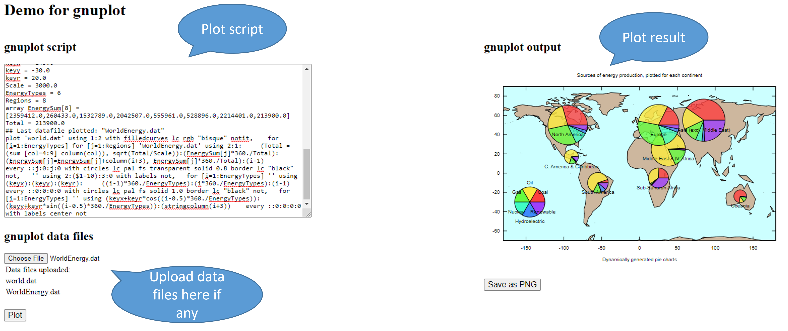

# Tutorial for building and running Gnuplot WASM demo with Webinizer

## How to build Gnuplot with Webinizer

1. **`Main page`** - Click `Get Started` in Webinizer main page to enter the project list page.

2. **`Get started page`** - Click the `SELECT` button of the Tetris project to enter the
   `Basic config` page.

3. **`Basic config page`** - Click `BUILD STEPS ->` in the lower right corner or `Steps` in the top
   navigation panel to enter the `Build steps` page.

4. **`Build steps page`**

   - Select the `static` build target and Webinizer will prompt you with the recommended build steps
     for the project.

   - Click `YES` to accept the recommendation.

   - Click `Config` in the top navigation panel to enter the `Configuration` page.

5. **`Configuration page`**

   - Click the `Env variables & Local data` section from the left side navigation panel.

   - Add `-sINVOKE_RUN=0` to the `Linker flags` text field.

     > Note. _This is to enable `not` running the main() function when WASM module is initialized._

   - Add `FS,callMain` to the `Exported runtime methods` text field.

     > Note. _This is to export the `FS` library object and `callMain` method on the JS Module._

   - Click `Build` in the top navigation panel to enter the `Build` page.

6. **`Build page`**

   - Click the `BUILD` button and a recipe may apppear: `Recipe for main loop issue`.

     > Note. _As gnuplot is not running as a main-thread blocking application, this is not a real
     > issue._

   - Click the `IGNORE` button to ignore this recipe.

   - Click the `BUILD` button again and another recipe will show up:
     `Recipe for issue of building intermedium tools with native compiler other than Emscripten`.

     > Note. _This recipe is shown because `gnuplot` build process needs to build native tools to
     > generate some intermedium files, these tools should be native binaries. However, as Webinizer
     > uses Emscripten to build project, these tools were built as JS and WASM files by default._
     >
     > ```bash
     > ./doc2gih ./gnuplot.doc gnuplot.gih
     > Makefile:1178: recipe for target 'gnuplot.gih' failed
     > /bin/bash: ./doc2gih: Permission denied
     > make[3]: *** [gnuplot.gih] Error 126
     > ```
     >
     > _We can check the build logs and find out the failed build target is `all` when building the
     > `docs` utilities, which is not a required part for running `gnuplot` application in the
     > browser._
     >
     > ```Makefile
     > # Makefile line 867
     > gnuplot:
     > cd src; make binonly
     > ```
     >
     > _After checking the available targets in the `Makefile`, we can choose to build target
     > `gnuplot` only._

   - Click `<- BUILD STEPS` in the lower left corner to go back to `Build steps` page again.

7. **`Build steps page`**

   - Click `MANAGE STEPS` and add `gnuplot` to `Arguments for build` of STEP3 `make`.

   - Click the `FINISH` button to save the changes.

   - Click `BUILD ->` in the lower right corner or `Build` in the top navigation panel to enter the
     `Build` page.

8. **`Build page`** - Click the `BUILD` button to trigger the build again.

After a while, it will show `Build successfully!` on the page.

## How to run the demo

- Below are the generated files that are required to run the demo. By default they are under `src`
  folder of the project root.

  - gnuplot.js
  - gnuplot.wasm

  ***

  > Note. If you are generating the target with different name rather than `gnuplot`, please also
  > modify below files as well.

  - The imported script `src` in `index.html`.

    ```html
    <!-- line 31 -->
    <script type="text/javascript" src="gnuplot.js"></script>
    ```

  - `run.sh`, the copy file names.
    ```sh
    # line 7
    cp ../../native_projects/gnuplot/src/gnuplot.* .
    ```

- Set up the server

  Run the script to copy all the required files and start the server.

  ```sh
  ./run.sh
  ```

- Run in the browser (`Chrome` recommended)

  ```
  http://localhost:8080
  ```

- Try it!

  Here is an example.

  

  - The plot script is `example/demo_script.txt`, you can copy the content to `script` section right
    after below line.

    ```
    ################################
    # your script starts from here #
    ################################
    ```

  - The data files are:

    - `example/world.dat`
    - `example/WorldEnergy.dat`

    Please upload them using `Choose File` button in `Data files` section.

  - After all set, just click `Plot` and get the output! The default output is in SVG format, you
    can save the result to local by clicking `Save as PNG`.
